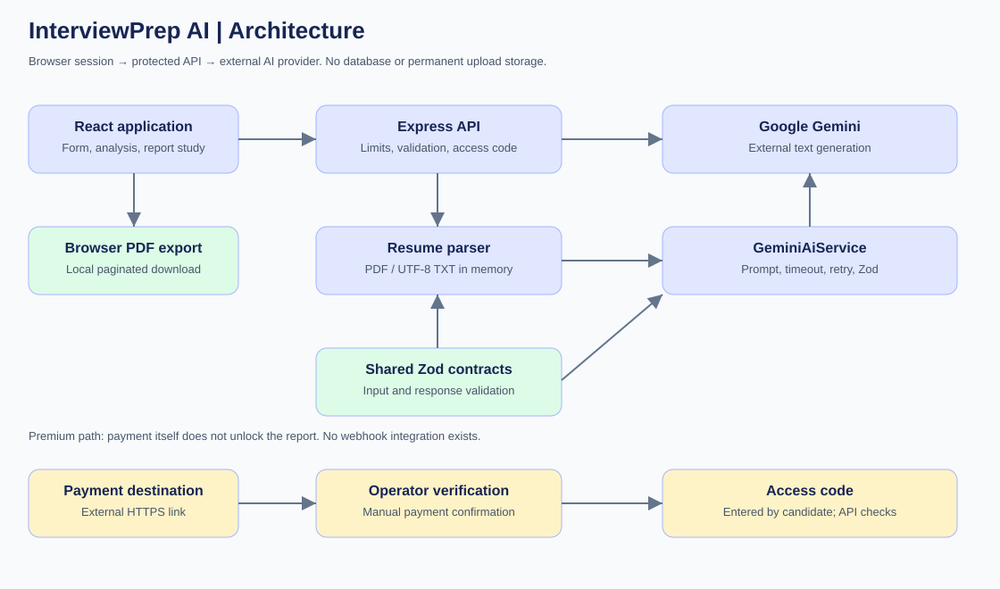
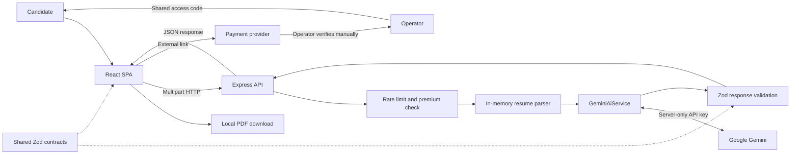
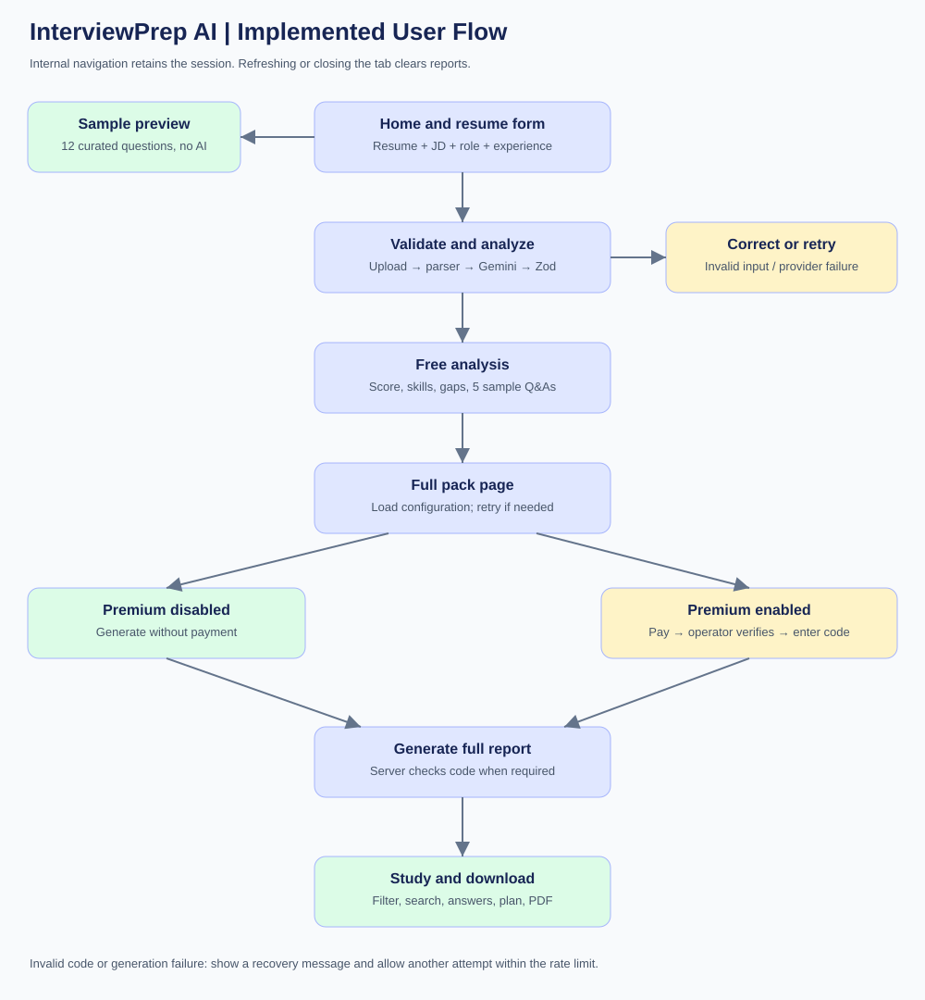
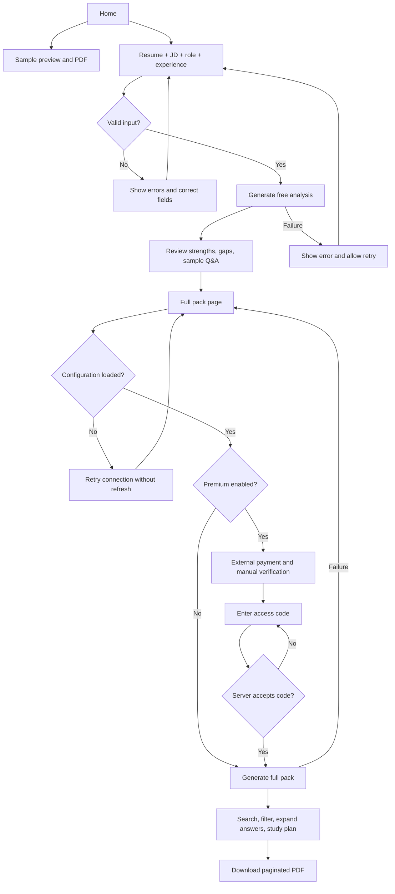
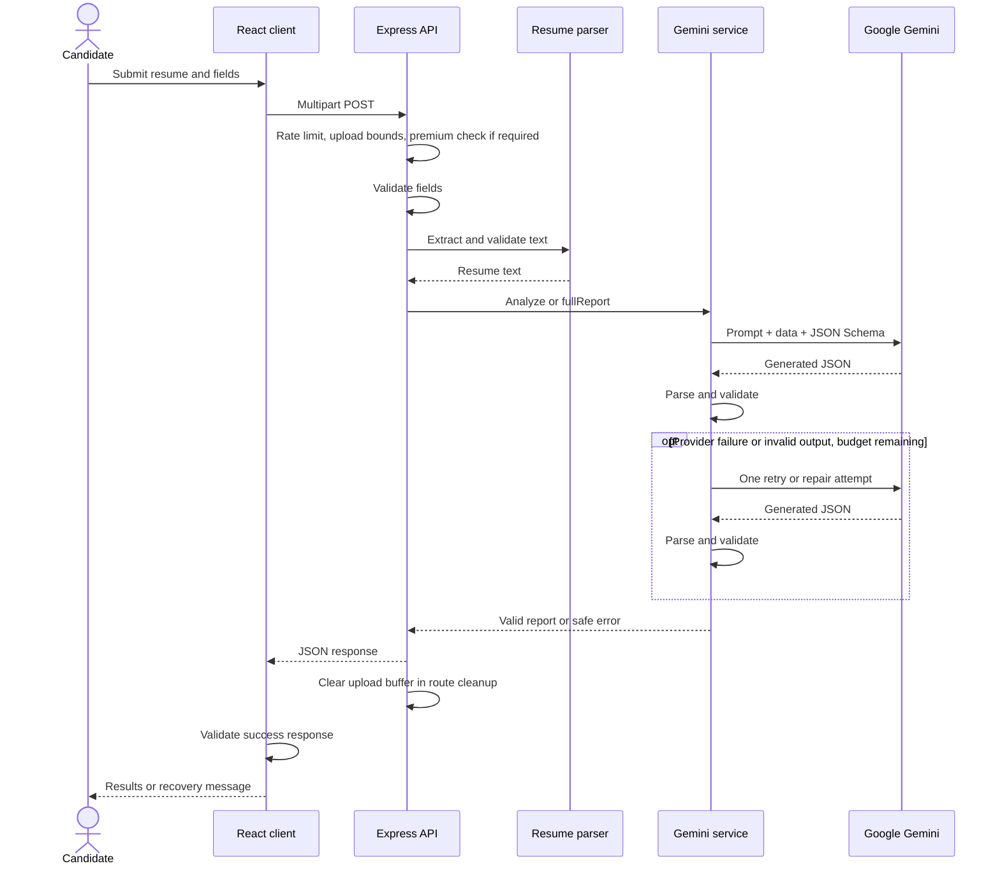

# Architecture and Flow Diagrams

## Components and ownership

| Component | Responsibility | State |
|---|---|---|
| React app | Routes, forms, report study, browser PDF export | Current tab memory |
| API client | Multipart requests, timeouts, error translation, response checks | No persistence |
| Express middleware | Security headers, CORS, rate limit, upload limits, request ID | Per-process IP counters |
| Resume parser | UTF-8 and PDF text extraction and length checks | Request memory |
| AiService interface | Separates HTTP routes from provider implementation and test doubles | None |
| GeminiAiService | Prompt, structured output, bounded retries, schema validation | Request memory |
| Shared schemas | Input and report contracts, semantic uniqueness checks | None |
| Payment operator | Confirms external payment and supplies code manually | Outside this application |

## Architecture diagram

Editable Mermaid source:

## User flow diagram

## Generation sequence

## Trust boundaries and deployment

The browser is untrusted: field limits and premium checks are repeated at the API. CORS governs browser access and is not authentication. The payment provider has no callback into this API. Only the operator's configured code authorizes premium generation. Provider output is untrusted until validated. Prompt instructions label resume and JD content as data, although this is not a guarantee against all prompt injection.

Locally Vite proxies `/api` to port 8080. The provided hosting templates deploy static frontend files to Netlify and the Node API to Render. `VITE_API_URL` is public build-time configuration; `GEMINI_API_KEY` and `PREMIUM_ACCESS_CODE` exist only on the API server. Docker packages the backend, not a combined frontend host.
